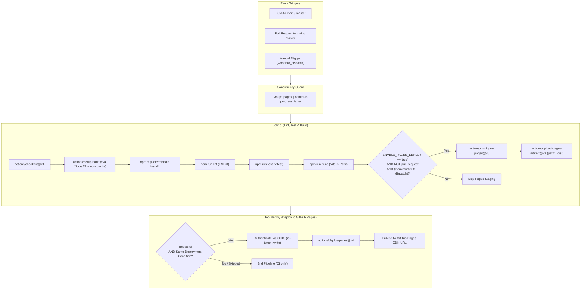

# End-to-End Guide: CI/CD Pipeline Architecture (`ci-cd.yml`)

This document provides a comprehensive A-to-Z explanation of the GitHub Actions workflow defined in [`ci-cd.yml`](file:///c:/Users/EgDEv13/.gemini/antigravity/scratch/wedding-wishes/.github/workflows/ci-cd.yml). It covers workflow lifecycle triggers, permission models, concurrency locks, job execution stages, and the deployment mechanism to GitHub Pages.

---

## 1. High-Level Pipeline Architecture

The workflow is split into two primary phases:
1. **Continuous Integration (`ci`)**: Validates code quality via static analysis (linting), executes unit tests, compiles the production build, and conditionally packages distribution assets.
2. **Continuous Deployment (`deploy`)**: Ingests the packaged artifact and deploys it to GitHub Pages using OpenID Connect (OIDC) authentication.



---

## 2. Line-by-Line Breakdown: Section by Section

### A. Pipeline Identity & Event Triggers ([Lines 1–8](file:///c:/Users/EgDEv13/.gemini/antigravity/scratch/wedding-wishes/.github/workflows/ci-cd.yml#L1-L8))

```yaml
name: CI/CD Pipeline

on:
  push:
    branches: [main, master]
  pull_request:
    branches: [main, master]
  workflow_dispatch:
```

- **`name`**: The human-readable name displayed in the repository's **Actions** dashboard.
- **`push: branches: [main, master]`**: Automatically triggers the pipeline whenever code is directly committed or merged into `main` or `master`.
- **`pull_request: branches: [main, master]`**: Triggers validation runs on any Pull Request targeting `main` or `master`. This acts as a quality gate before merging.
- **`workflow_dispatch`**: Adds a manual "Run workflow" button in the GitHub Actions UI, allowing developers to execute the pipeline on-demand without pushing new commits.

---

### B. Security & Concurrency Controls ([Lines 10–15](file:///c:/Users/EgDEv13/.gemini/antigravity/scratch/wedding-wishes/.github/workflows/ci-cd.yml#L10-L15))

```yaml
permissions:
  contents: read

concurrency:
  group: 'pages'
  cancel-in-progress: false
```

- **`permissions: contents: read`**: Adheres to the **Principle of Least Privilege**. By default, GitHub Actions tokens have minimal permissions (read-only repository contents access), reducing blast radius if a dependency or action is compromised.
- **`concurrency.group: 'pages'`**: Ensures that all workflow runs targeting GitHub Pages share a single execution queue named `'pages'`.
- **`cancel-in-progress: false`**: Crucial for deployment workflows. Rather than aborting an in-flight deployment when a new commit lands, the existing deployment runs to completion, and queued runs execute in order. This prevents corrupt or inconsistent deployment states.

---

### C. Job 1: `ci` — Lint, Test & Build ([Lines 17–52](file:///c:/Users/EgDEv13/.gemini/antigravity/scratch/wedding-wishes/.github/workflows/ci-cd.yml#L17-L52))

```yaml
jobs:
  ci:
    name: Lint, Test & Build
    runs-on: ubuntu-latest
```

This job executes on a fresh GitHub-hosted Ubuntu virtual machine (`ubuntu-latest`).

#### Step-by-Step CI Execution:

1. **Repository Checkout ([Lines 22–23](file:///c:/Users/EgDEv13/.gemini/antigravity/scratch/wedding-wishes/.github/workflows/ci-cd.yml#L22-L23))**
   ```yaml
   - name: Checkout repository
     uses: actions/checkout@v4
   ```
   Clones the repository files into the runner workspace so subsequent steps can operate on the source tree.

2. **Node.js Environment & Dependency Cache ([Lines 25–29](file:///c:/Users/EgDEv13/.gemini/antigravity/scratch/wedding-wishes/.github/workflows/ci-cd.yml#L25-L29))**
   ```yaml
   - name: Setup Node.js
     uses: actions/setup-node@v4
     with:
       node-version: 22
       cache: 'npm'
   ```
   Installs Node.js v22 and automatically caches the global npm directory keyed against `package-lock.json`. Subsequent pipeline runs experience drastically reduced install times.

3. **Deterministic Dependency Installation ([Lines 31–32](file:///c:/Users/EgDEv13/.gemini/antigravity/scratch/wedding-wishes/.github/workflows/ci-cd.yml#L31-L32))**
   ```yaml
   - name: Install dependencies
     run: npm ci
   ```
   Uses `npm ci` instead of `npm install`. This guarantees strict, reproducible installs directly from `package-lock.json` and deletes any pre-existing `node_modules`.

4. **Code Quality: Linting ([Lines 34–35](file:///c:/Users/EgDEv13/.gemini/antigravity/scratch/wedding-wishes/.github/workflows/ci-cd.yml#L34-L35))**
   ```yaml
   - name: Run Lint
     run: npm run lint
   ```
   Executes `eslint .` (as defined in [`package.json`](file:///c:/Users/EgDEv13/.gemini/antigravity/scratch/wedding-wishes/package.json#L10)). Catches syntax errors, code style inconsistencies, and React hook rule violations.

5. **Automated Testing ([Lines 37–38](file:///c:/Users/EgDEv13/.gemini/antigravity/scratch/wedding-wishes/.github/workflows/ci-cd.yml#L37-L38))**
   ```yaml
   - name: Run Unit Tests
     run: npm run test
   ```
   Executes Vitest (`vitest run` in non-watch mode). Ensures all components and utility functions pass their test suites prior to bundling.

6. **Production Compilation ([Lines 40–41](file:///c:/Users/EgDEv13/.gemini/antigravity/scratch/wedding-wishes/.github/workflows/ci-cd.yml#L40-L41))**
   ```yaml
   - name: Run Build
     run: npm run build
   ```
   Runs `vite build`, bundling React components, CSS (Tailwind/PostCSS), and assets into an optimized, minified static distribution in `./dist`.

7. **Pages Setup & Artifact Packaging ([Lines 43–52](file:///c:/Users/EgDEv13/.gemini/antigravity/scratch/wedding-wishes/.github/workflows/ci-cd.yml#L43-L52))**
   ```yaml
   - name: Setup Pages
     if: vars.ENABLE_PAGES_DEPLOY == 'true' && github.event_name != 'pull_request' && (github.event_name == 'workflow_dispatch' || github.ref == 'refs/heads/main' || github.ref == 'refs/heads/master')
     uses: actions/configure-pages@v5

   - name: Upload GitHub Pages artifact
     if: vars.ENABLE_PAGES_DEPLOY == 'true' && github.event_name != 'pull_request' && (github.event_name == 'workflow_dispatch' || github.ref == 'refs/heads/main' || github.ref == 'refs/heads/master')
     uses: actions/upload-pages-artifact@v3
     with:
       path: ./dist
   ```
   - **Condition Check**:
     - `vars.ENABLE_PAGES_DEPLOY == 'true'`: An explicit repository feature flag. Deployments remain inactive until the repository owner sets this variable.
     - `github.event_name != 'pull_request'`: PRs only run lint, tests, and build to verify validity; they do not stage production artifacts.
     - Branch / dispatch check: Ensures staging only occurs on `main`, `master`, or explicit manual dispatches.
   - `actions/configure-pages@v5`: Automatically configures base path metadata and site URLs for GitHub Pages.
   - `actions/upload-pages-artifact@v3`: Packages the `./dist` folder into a standardized GitHub Pages tarball (`github-pages`) for downstream deployment.

---

### D. Job 2: `deploy` — Continuous Deployment ([Lines 53–69](file:///c:/Users/EgDEv13/.gemini/antigravity/scratch/wedding-wishes/.github/workflows/ci-cd.yml#L53-L69))

```yaml
  deploy:
    name: Deploy to GitHub Pages
    needs: ci
    if: vars.ENABLE_PAGES_DEPLOY == 'true' && github.event_name != 'pull_request' && (github.event_name == 'workflow_dispatch' || github.ref == 'refs/heads/main' || github.ref == 'refs/heads/master')
    runs-on: ubuntu-latest
    permissions:
      pages: write
      id-token: write
      contents: read
    environment:
      name: github-pages
      url: ${{ steps.deployment.outputs.page_url }}
    steps:
      - name: Deploy to GitHub Pages
        id: deployment
        uses: actions/deploy-pages@v4
```

#### Key Capabilities of the Deploy Job:

1. **Dependency Gate (`needs: ci`)**:
   Guarantees that `deploy` will not run unless the `ci` job completes with status `success`. If linting, tests, or building fails, deployment is automatically skipped.
2. **Elevated Permissions**:
   - `pages: write`: Allows writing files to the GitHub Pages service.
   - `id-token: write`: Authorizes minting an OpenID Connect (OIDC) JWT token to securely authenticate against GitHub Pages without maintaining manual API tokens or personal access tokens (PATs).
3. **Environment Tracking (`environment`)**:
   Tracks releases under the `github-pages` environment in the repository. Once deployed, GitHub dynamically captures `steps.deployment.outputs.page_url` and displays a direct link to the live website on the PR and commit page.
4. **`actions/deploy-pages@v4`**:
   Extracts the artifact uploaded in step 7 of the `ci` job and promotes it to the live GitHub Pages CDN.

---

## 3. Configuration & Activation Guide

To activate the CD portion of this pipeline on GitHub:

> [!IMPORTANT]
> Because of the condition `vars.ENABLE_PAGES_DEPLOY == 'true'`, the deployment job will remain skipped by default until the variable is configured in GitHub repository settings.

### Steps to Enable:
1. **Configure Pages Source**:
   - Navigate to **Settings** > **Pages** in your GitHub repository.
   - Under **Build and deployment** > **Source**, select **GitHub Actions**.
2. **Set the Configuration Variable**:
   - Navigate to **Settings** > **Secrets and variables** > **Actions** > **Variables** tab.
   - Click **New repository variable**.
   - Name: `ENABLE_PAGES_DEPLOY`
   - Value: `true`
3. **Trigger Deployment**:
   - Push to `main` (or `master`), or navigate to **Actions** > **CI/CD Pipeline** > **Run workflow**.

---

## 4. Pipeline Characteristics & Best Practice Summary

| Feature | Implementation | Benefit |
| :--- | :--- | :--- |
| **Reproducibility** | `node-version: 22` + `npm ci` | Identical build output regardless of runner environment. |
| **Speed / Optimization** | `cache: 'npm'` | Reuses downloaded packages across workflow executions. |
| **Quality Gates** | `npm run lint` & `npm run test` | Prevents broken code and regressions from reaching production. |
| **Security** | Least privilege + OIDC token minting | Eliminates static secret management and restricts access scope. |
| **Safety Flag** | `vars.ENABLE_PAGES_DEPLOY` | Provides an opt-in kill switch for site deployment. |
| **Race Protection** | `concurrency.cancel-in-progress: false` | Prevents mid-deployment cancellations and CDN corruption. |
